# Guía de Usuario

## Sistema de Reparto — Rincón del Sur

Versión 3 · Octubre 2026

Esta guía explica, paso a paso y con fotografías de la pantalla, cómo usar el sistema en el trabajo de todos los días. Está organizada **por rol**: andá directo a la sección de lo que hacés vos.

## Índice

1. [Antes de empezar](#1-antes-de-empezar) — cómo entrar, qué ve cada rol, cómo moverse
2. [Chofer / Vendedor](#2-chofer-vendedor-desde-el-celular) — vender y cobrar desde el celular
3. [Administración Operativa](#3-administración-operativa) — clientes, viajes, productos, pedidos, rendiciones, gastos
4. [Depósito](#4-depósito) — stock y listado de despacho
5. [Gerencia](#5-gerencia) — cajas, comisiones, cobranza
6. [Administrador del sistema](#6-administrador-del-sistema) — usuarios, claves, camiones
7. [Preguntas frecuentes y problemas comunes](#7-preguntas-frecuentes-y-problemas-comunes)
8. [Un día típico](#8-un-día-típico-en-rincón-del-sur)

## 1. Antes de empezar

### 1.1 Cómo entrar al sistema

1. Abrí el navegador e ingresá a la dirección del sistema (hoy: `https://rincondelsur.duckdns.org`). Tiene que verse un **candado** en la barra de direcciones.
2. En **Correo electrónico** escribí tu **usuario** (por ejemplo `camion1`) y en **Contraseña** la clave que te dio el administrador.
3. Tocá **Iniciar sesión**.

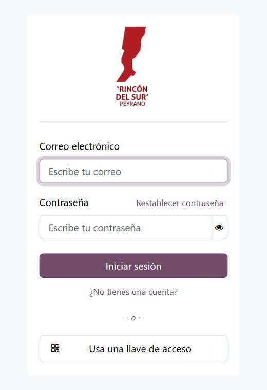

> **La primera vez, cambiá tu contraseña:** tocá tu nombre (arriba a la derecha) → **Preferencias** → pestaña **Seguridad** → **Cambiar contraseña**. Si la olvidás, pedile una nueva al administrador del sistema (sección 6).

#### Qué navegador usar

| Dispositivo | Navegador recomendado |
|---|---|
| iPhone / iPad | **Safari** (no uses Brave ni Firefox: muestran un cartel de error que no es del sistema) |
| Android | **Chrome** |
| Computadora | Chrome o Edge |

**Para usarlo como una aplicación** (pantalla completa, sin barra de direcciones): en iPhone, botón Compartir → **Añadir a pantalla de inicio**; en Android, menú ⋮ → **Instalar aplicación**.

### 1.2 Qué ve cada rol

Al entrar aparece **Inicio**, con un cuadro grande por cada cosa que tu rol puede usar. Tocás uno y se abre. Para volver a Inicio desde cualquier pantalla, tocá la **casita** de la barra de arriba.

| Rol | Cuadros que ve | Qué hace |
|---|---|---|
| **Chofer / Vendedor** | Viaje, Clientes, Punto de venta | Reparte y vende desde **su** camión. Ve solo **sus** clientes. |
| **Administración Operativa** | Clientes, Punto de venta, Inventario | Arma los viajes, carga clientes, imprime remitos, **confirma rendiciones** y anota gastos. |
| **Depósito** | Clientes, Inventario | Controla el stock y confirma el listado de despacho. |
| **Gerencia** | Clientes, Punto de venta, Facturación, Inventario | Mira cajas, comisiones y cobranza; registra cobros de cuenta corriente. |

Además existe el usuario **admin**, que es solo para quien administra el sistema (crear usuarios, cambiar claves).

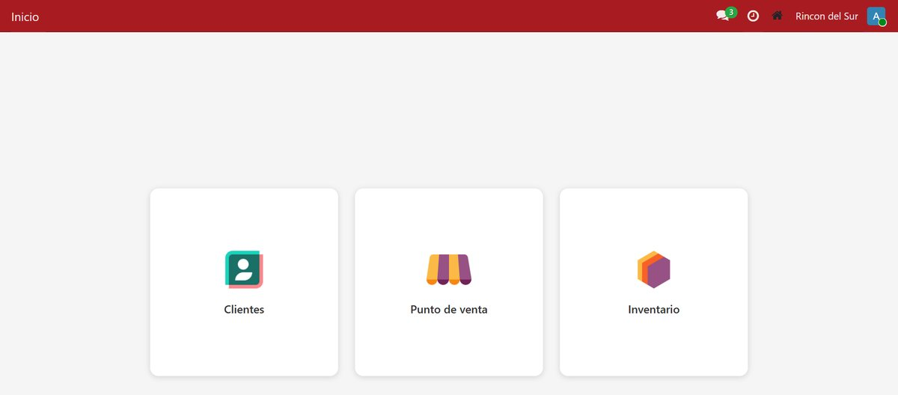
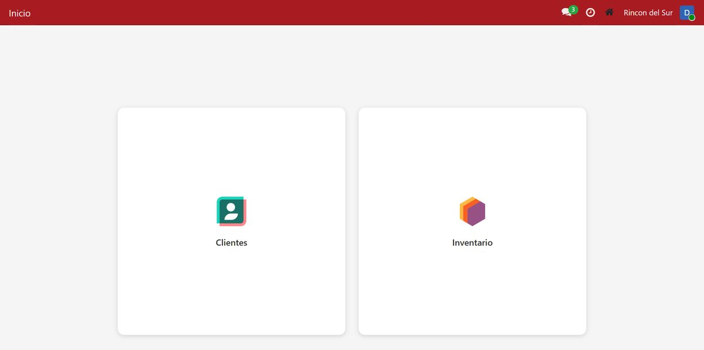
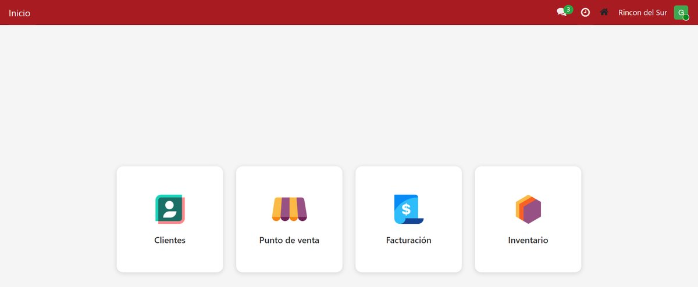

### 1.3 Cómo funciona el negocio en el sistema (en 6 líneas)

1. **Administración** arma el **viaje** del día de cada chofer: la lista de clientes a visitar.
2. El **chofer** abre su viaje, toca el cliente y **carga el pedido y cobra** desde el celular.
3. Lo vendido **no baja el stock** al instante: baja cuando **Depósito confirma el listado de despacho**.
4. Lo que cobra el chofer queda **pendiente de rendir** a su nombre.
5. Al final del día **Administración rinde** al chofer y recién ahí la plata aparece en las **Cajas** de la empresa.
6. **Gerencia** mira cajas, comisiones y deudas.

> **Este sistema no factura.** La factura se sigue haciendo con el programa de la PC. Lo que genera el sistema es un **remito interno**, como constancia de lo entregado.

## 2. Chofer / Vendedor (desde el celular)

Todo lo de este capítulo se hace en el celular o la tablet del camión.

### 2.1 Tu viaje del día

1. En **Inicio** tocá **Viaje**.
2. Aparece la lista de clientes que tenés que visitar hoy. Si un cliente **te debe plata**, ves en rojo **"Debe $…"** debajo de su nombre.
3. Cuando cobrás a un cliente, su parada se **tilda sola** con una ✓ verde.

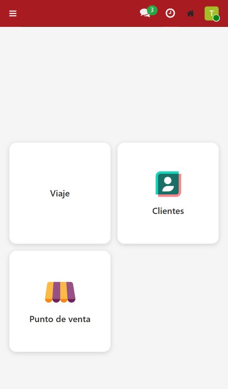
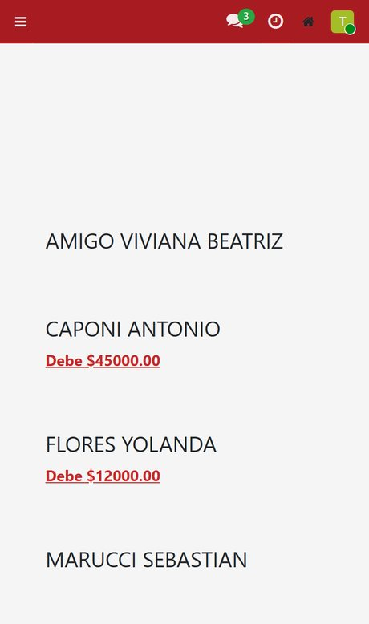

> Si no ves ningún cliente en **Viaje**, todavía no te armaron el viaje de hoy: avisale a Administración. Si te sale un error, probablemente un cliente de la lista no está asignado a vos (sección 3.1).

### 2.2 Hacer una venta

1. En **Viaje**, tocá el **nombre del cliente**. Se abre el punto de venta con ese cliente **ya elegido**.
2. **La primera vez del día** aparece **Control de apertura**: en **Efectivo de apertura** poné el efectivo que realmente tenés en la caja al salir (si rendiste todo ayer, **0**) y tocá **Abrir caja registradora**.
3. En la grilla, tocá cada **producto** para agregarlo (cada toque suma una unidad). El número en cada producto (por ejemplo **150u**) es el stock disponible.
4. Para ver el pedido, tocá **Carrito**. Para cambiar una cantidad: tocá la línea y escribí el número con el teclado (con **Cant.** seleccionado).
5. Mirá las líneas del carrito: los **descuentos por cantidad se aplican solos**. En verde ves el tramo que ya alcanzaste (**10+ u → 4%**) y en gris los próximos; bajo cada producto dice cuántos **quedan disponibles**.
6. Tocá **Pago**, elegí el medio de pago y tocá **Validar**.

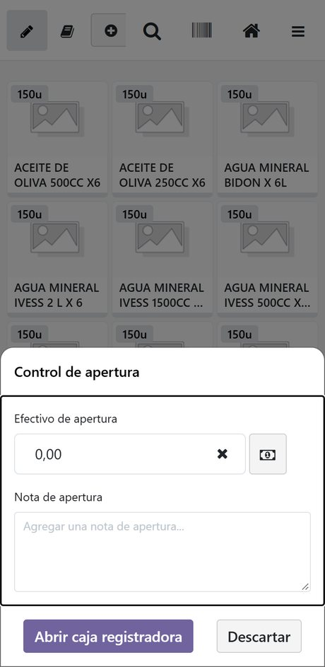
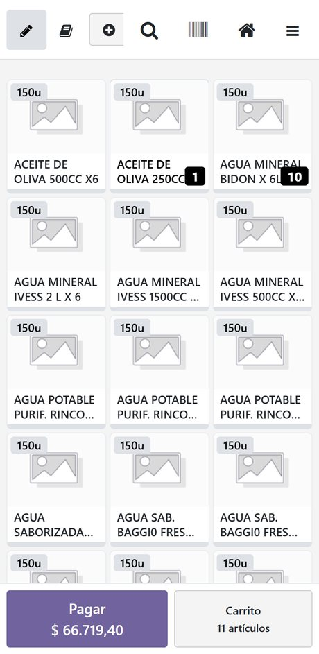
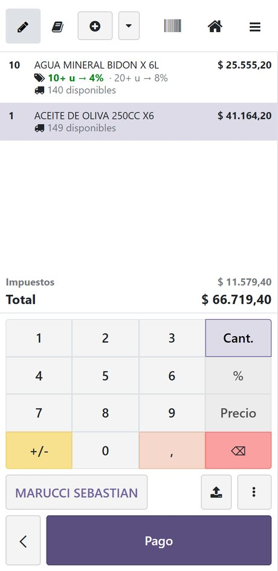

**Medios de pago**

| Medio | Qué pasa |
|---|---|
| **Efectivo Camión N** | Cobrás en el momento. Queda pendiente de rendir a tu nombre. |
| **Tarjeta** | Cobrás en el momento (va a la caja de transferencias). |
| **Cuenta corriente** | El cliente queda debiendo (ver 2.3). |

> Dejá **Recibo/Factura sin tildar**: el sistema no factura.
> Los botones **%** y **Precio** del teclado están deshabilitados para vos: **solo Administración y Gerencia** pueden cambiar un precio o poner un descuento a mano.

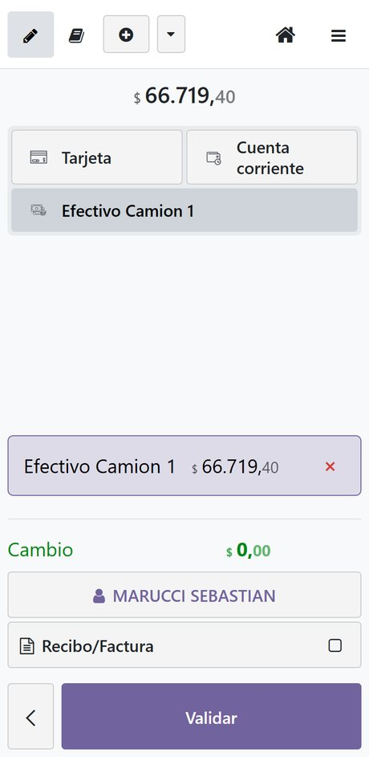
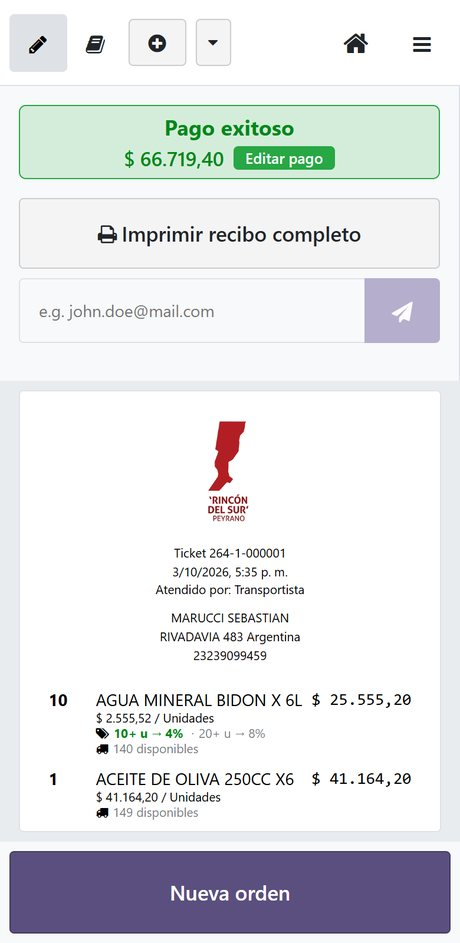

Tocá **Nueva orden** para seguir con otra venta, o la **casita** para volver a Inicio.

**Si sale "Stock insuficiente":** pediste más de lo que hay. El cartel dice cuánto hay disponible; corregí la cantidad o avisá a Depósito que falta ese producto.

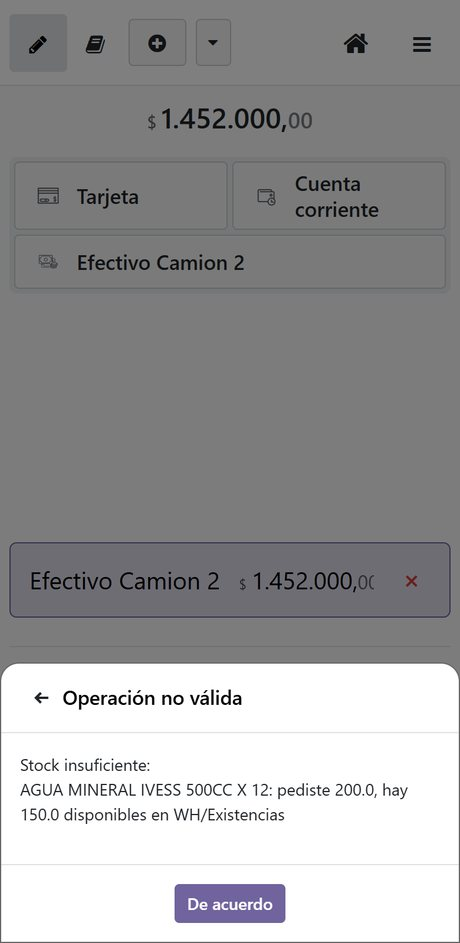

### 2.3 Vender a cuenta corriente

1. Cargá el pedido como siempre y en **Pago** elegí **Cuenta corriente**.
2. El cliente tiene que estar elegido (si entraste desde Viaje ya lo está).
3. Tocá **Validar**.

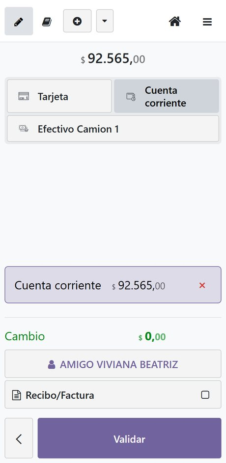

> **Ojo:** la deuda aparece en **Deudores** y en **Cuenta Corriente** recién cuando **cerrás la caja** (sección 2.6). Si no la cerrás, la deuda no se ve.

**Aviso de deuda vencida.** Si elegís **a mano** (desde el botón **Cliente**) un cliente que debe plata, aparece un cartel con el monto y los días sin pagar. **Es solo informativo: no impide vender.**

- Menos de 10 días: aviso simple.
- 10 días o más: **"Cliente cerca del límite de crédito"**.
- 15 días o más: **"¡Cliente con deuda vencida!"** (es el máximo de crédito del negocio).

Cuando entrás por **Viaje**, la deuda ya la ves en la lista, en rojo.

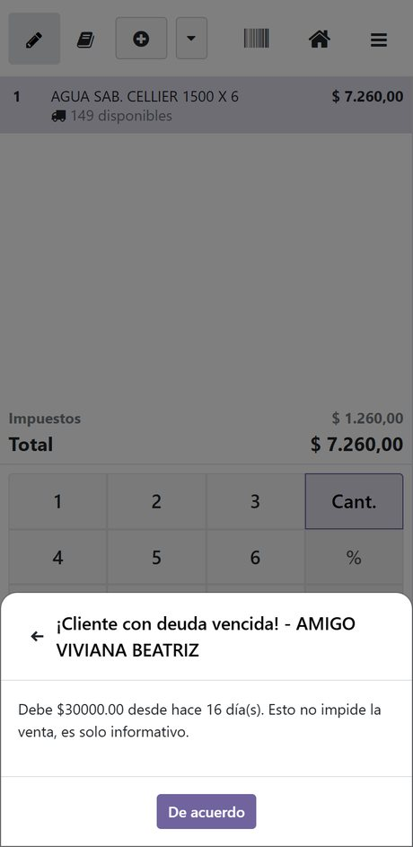

### 2.4 Cobrar una deuda vieja desde Viaje (sin vender nada)

Si un cliente de tu lista te debe plata, podés cobrarla **ahí mismo**, sin abrir el punto de venta.

1. En **Viaje**, tocá el monto en rojo (**Debe $…**) del cliente. *(Tocá el monto, no el resto de la fila: la fila abre el punto de venta.)*
2. Se abre un cuadro con el monto de la deuda. **Podés cambiarlo** (por ejemplo, si el cliente paga solo una parte).
3. Elegí **Efectivo** o **Transferencia** y tocá **Continuar**.
4. El sistema pregunta **¿Confirmás cobrar $… a …?** Es plata real y **no se puede deshacer desde esta pantalla**. Tocá **De acuerdo**.
5. La deuda baja al instante y la parada queda marcada ✓.

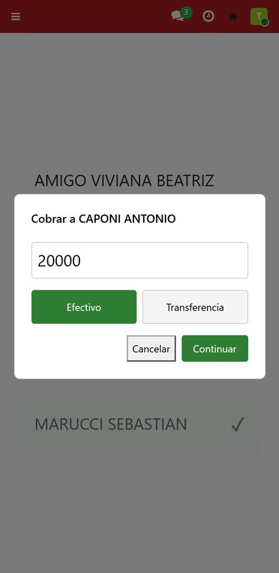
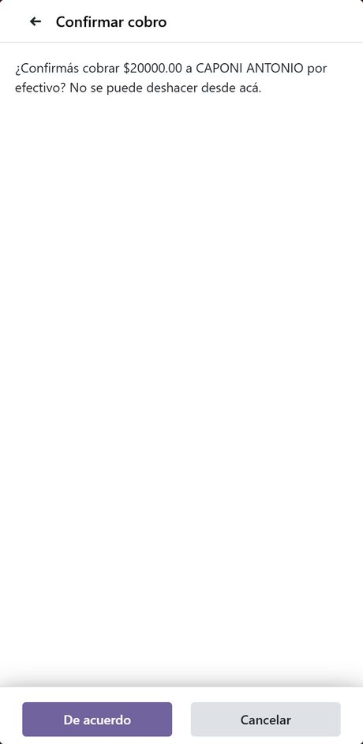
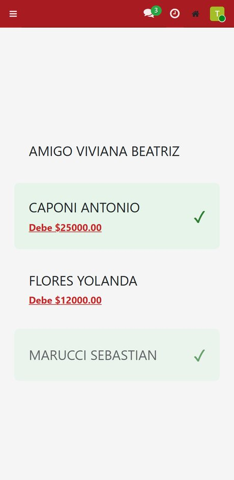

> El monto **no puede ser mayor** a la deuda. Solo podés cobrar en **tus** paradas.

### 2.5 Si se corta la señal

El punto de venta **sigue funcionando sin internet**:

- Aparece el cartel **"Conexión perdida"**. Tocá **Continuar con funcionalidad limitada** y **seguí vendiendo y cobrando** con normalidad.
- Arriba, el ícono de conexión se ve **tachado** mientras no hay señal.
- La venta queda guardada **en el celular**.
- Cuando vuelve la señal, **se envía sola** en unos segundos. No tenés que hacer nada.

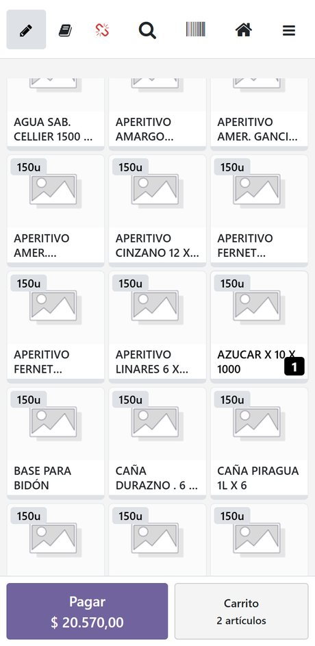
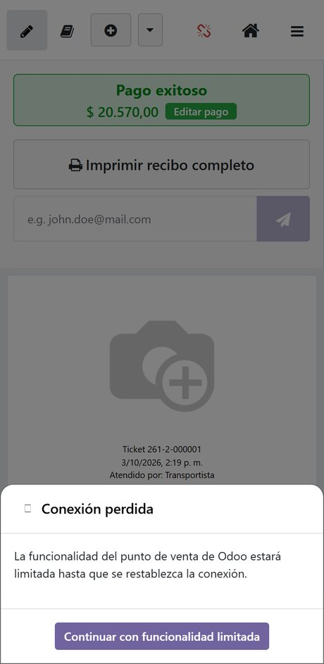

> **No borres los datos del navegador ni cierres sesión** mientras haya ventas sin enviar. Esperá unos segundos de señal antes de cerrar la aplicación.

### 2.6 Cerrar la caja al terminar el día

1. Tocá el menú **☰** (arriba a la derecha) y elegí **Cerrar caja registradora**.
2. Revisá el resumen: total vendido y desglose por medio de pago (**Efectivo**, **Tarjeta**, **Cuenta corriente**).
3. Si cobraste deudas desde Viaje (2.4), aparece el cuadro amarillo **"Deudas cobradas hoy desde Viaje"** con el monto en efectivo y en transferencia. **Esa plata no entra en este conteo:** separala.
4. En **Conteo de efectivo** escribí el efectivo **de las ventas** (lo que figura en *Efectivo Camión N*).
5. Tocá **Cerrar caja registradora**.

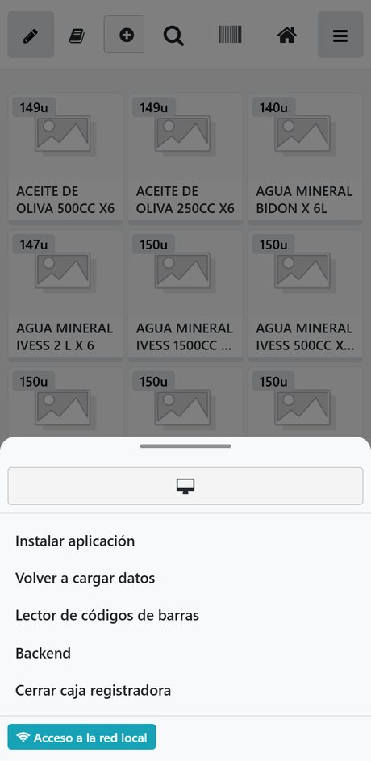
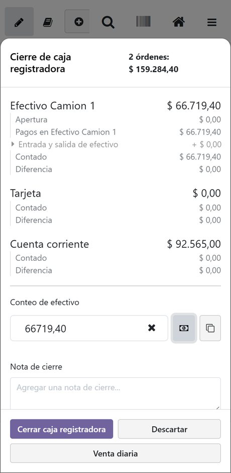

Si lo contado no coincide con lo esperado, aparece **"Diferencia de pagos"**. Podés volver (**Descartar**) y recontar, o **Continuar de todos modos** para registrar la diferencia.

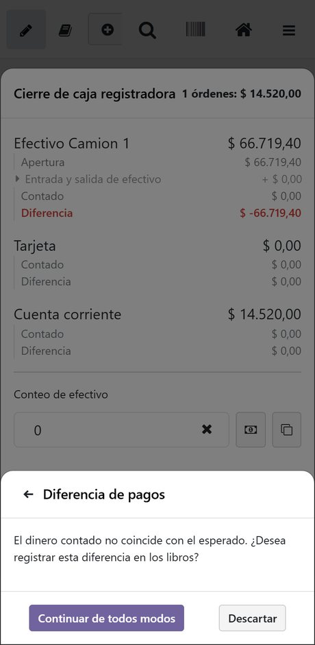

> **Antes de cerrar**, asegurate de que todas las ventas estén enviadas (sección 2.5).
> **Lo cobrado de deudas desde Viaje (2.4) no se cuenta en el cierre**: el sistema te lo muestra aparte (cuadro amarillo) y se controla en la **Rendición** que te hace Administración (sección 3.8). Entregale a Administración **todo** el efectivo que juntaste: ventas y cobros de deuda.
> Para volver a vender hay que abrir una caja nueva.

## 3. Administración Operativa

Se trabaja desde la computadora. Desde **Inicio** entrás a **Clientes**, **Punto de venta** (que también contiene Viajes, Rendiciones, Cajas, Gastos y demás) e **Inventario**.

### 3.1 Clientes

**Buscar un cliente.** **Inicio → Clientes**. Escribí parte del nombre en el buscador y apretá **Enter**.

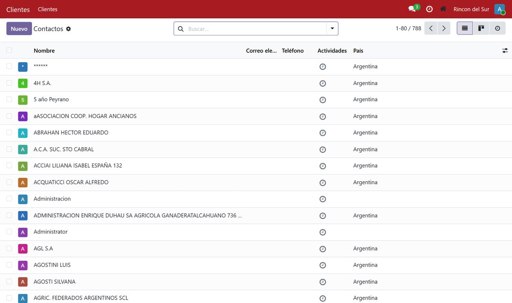
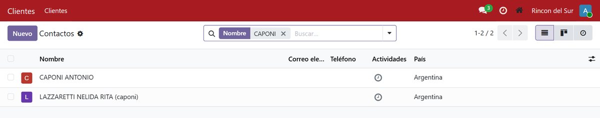

**Abrir la ficha.** Tocá el cliente. Ves dirección, **CUIT** (Número de Identificación) y teléfono.

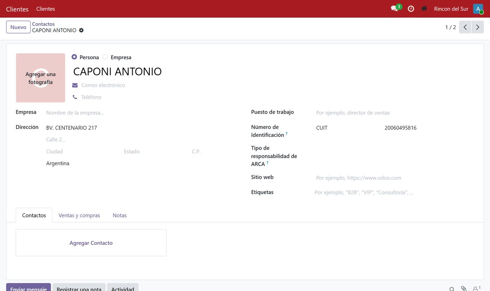

**Asignarle un camión (vendedor) — importante.** En la ficha, pestaña **Ventas y compras**, campo **Vendedor**: elegí el usuario del camión que lo atiende (por ejemplo *Transportista Camion 1*).

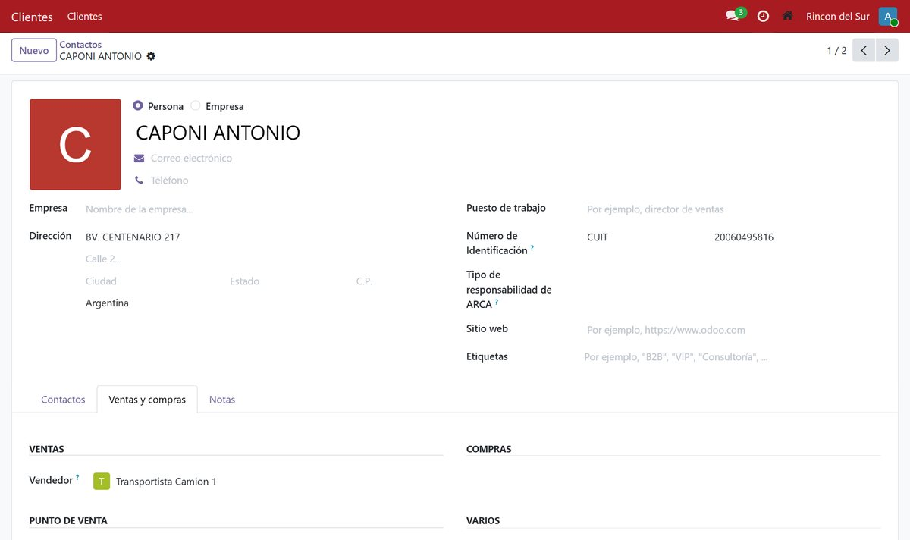

> **Por qué importa:** cada chofer ve **solo los clientes que tiene asignados**. Si un cliente no tiene vendedor, el chofer no lo encuentra en el punto de venta y, si está en un viaje, la pantalla **Viaje** da error. Asignalo **antes** de que el chofer salga.

**Crear un cliente nuevo**

1. **Clientes → Nuevo**.
2. Completá **Nombre**, **Dirección**, **Teléfono** y, si lo conocés, el **CUIT**.
3. En la pestaña **Ventas y compras**, elegí el **Vendedor**.
4. Guardá con el ícono de la **nubecita** ☁ (arriba, junto al nombre).

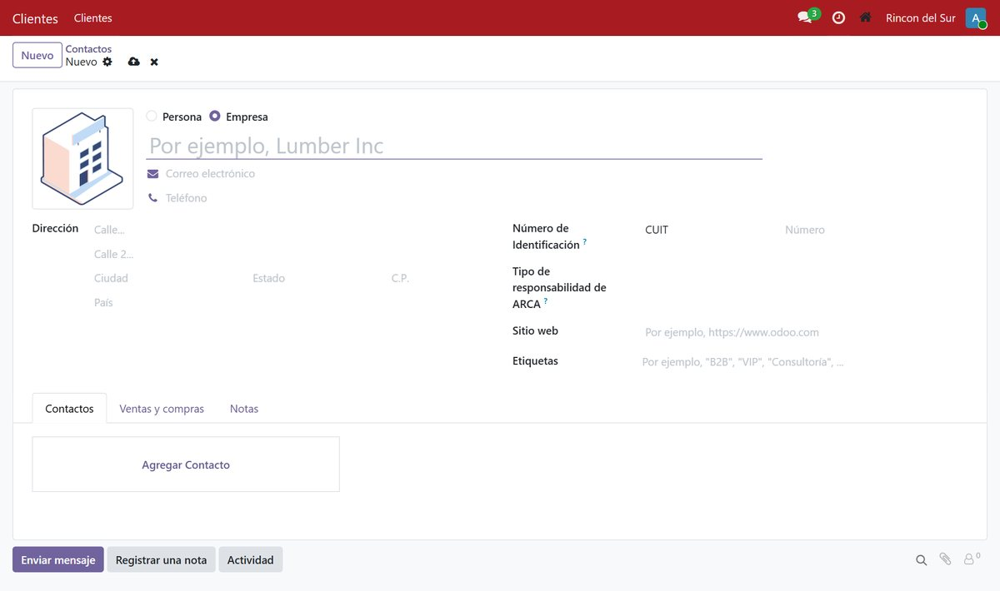

### 3.2 Armar el viaje del día

Un **viaje** es la hoja de ruta de un chofer para un día: la lista de clientes que tiene que visitar.

1. **Inicio → Punto de venta → Viajes → Nuevo**.
2. Elegí el **Chofer** y el **Punto de Venta** (el camión de ese chofer).
3. En **Paradas** tocá **Agregar una línea** y elegí un **Cliente**. Repetí por cada cliente.
4. Guardá (☁).

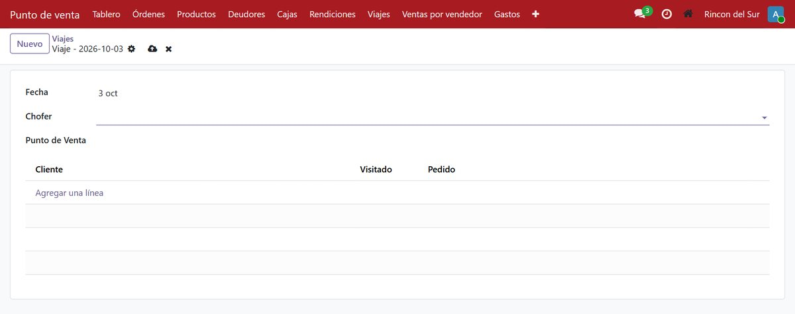
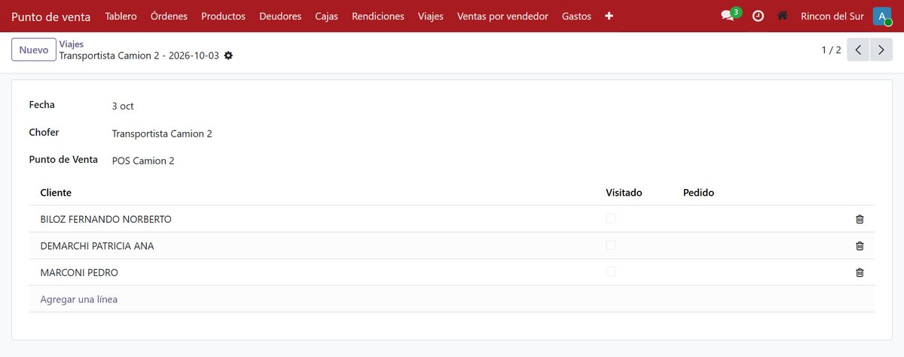

**Reglas**

- Cada chofer tiene **un solo viaje por día**. Si querés sumar clientes, abrí el viaje que ya existe. Si intentás crear otro, el sistema avisa *"Este chofer ya tiene un viaje asignado para esa fecha"*.
- Los clientes del viaje tienen que estar **asignados a ese chofer** (3.1).
- Un mismo cliente en viajes de dos choferes el mismo día no se bloquea: revisalo para no duplicar visitas.

**Seguir el avance.** En **Punto de venta → Viajes** ves, por cada chofer, cuántas paradas completó (por ejemplo *4 / 4 paradas, 100 %*). La parada se tilda **sola** cuando el chofer cobra a ese cliente: no hay que marcar nada a mano.

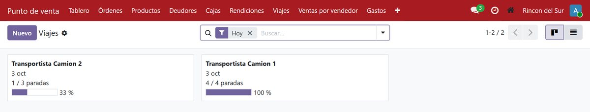

**Cuando un cliente llama y hace un pedido:** abrí el viaje del chofer que lo va a atender ese día (o creá uno), agregá el cliente como una parada más y guardá. El chofer lo ve en su lista (puede tener que recargar la pantalla). Al llegar, toca la parada, carga el pedido y cobra.

### 3.3 Productos, precios y descuentos por cantidad

**Ver o cambiar un producto.** **Inicio → Inventario → Productos → Productos**. Abrí el producto.

- **Precio de venta**: es el precio **sin IVA** (el punto de venta suma el 21%).
- Tiene que estar tildado **Punto de venta** para que aparezca en la grilla de los camiones, y **Rastrear inventario** para que el sistema controle el stock.
- Arriba a la derecha ves **A la mano** (stock físico) y **Pronosticado** (lo que queda descontando lo vendido y todavía no despachado).

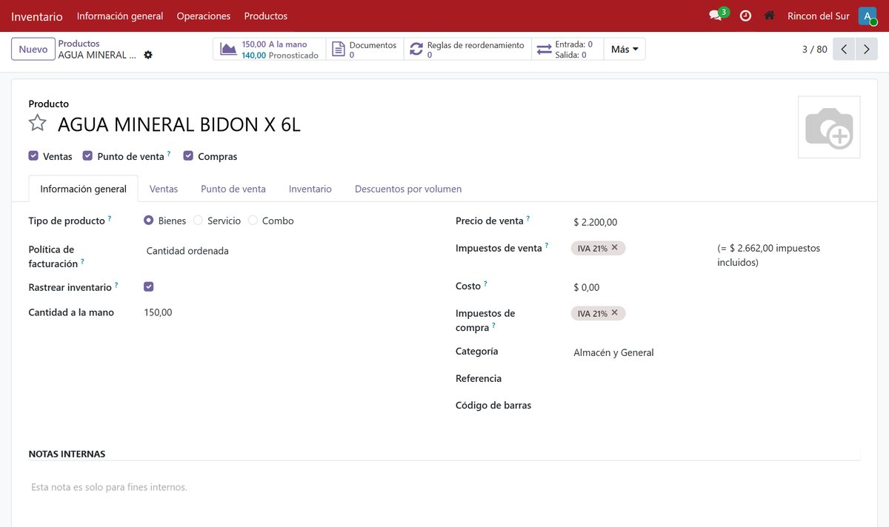

**Descuentos automáticos por cantidad.** En el producto, pestaña **Descuentos por volumen**: tocá **Agregar una línea** y completá **Cantidad mínima** y **% descuento** (por ejemplo, 10 unidades → 4%, 20 unidades → 8%). Guardá. En el camión el precio baja solo al llegar a cada tramo.

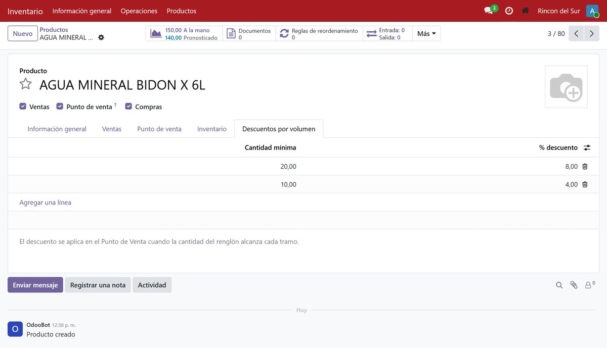

> Después de cambiar precios o descuentos, en la tablet del chofer: menú **☰ → Volver a cargar datos → Completo**.

### 3.4 Ver los pedidos y emitir el remito

1. **Inicio → Punto de venta → Órdenes → Órdenes**. Ves todos los pedidos de todos los camiones.
2. Abrí un pedido para ver cliente, productos, importes y quién lo cargó.
3. Para el **remito**: tocá el **engranaje ⚙ (Acciones)** junto al número de pedido y elegí **Remito Interno**. Se descarga el PDF para imprimir.

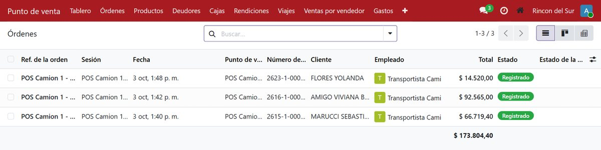
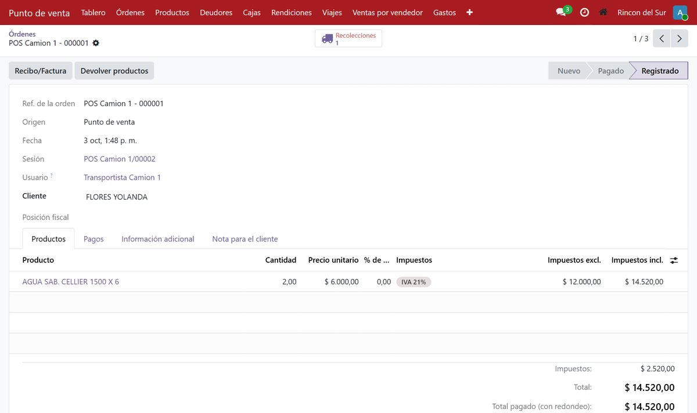
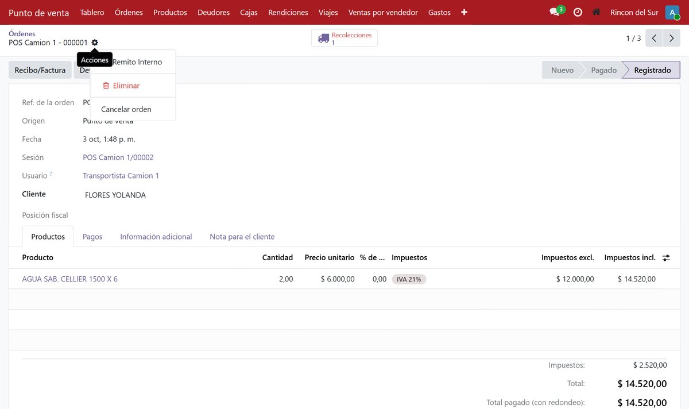
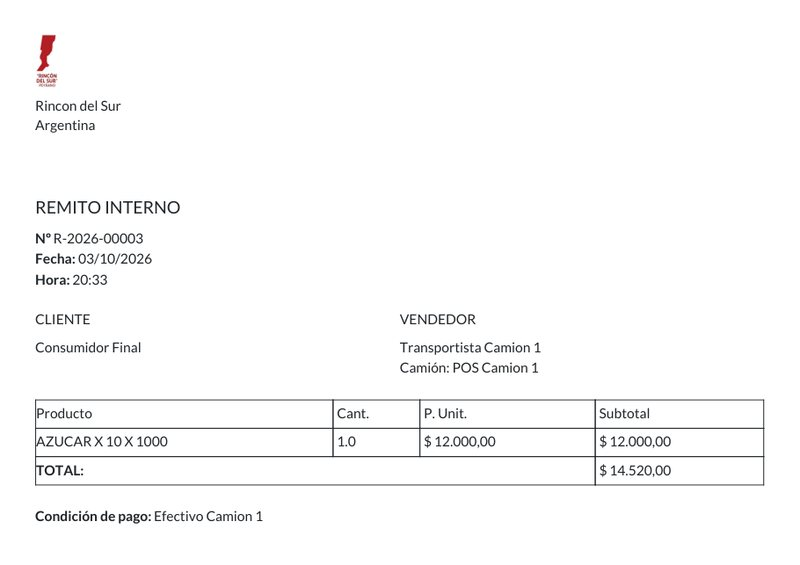

> No uses el botón **Recibo/Factura** del pedido: el sistema no factura. La factura se hace aparte, con el remito de respaldo.

### 3.5 Cargar un pedido para un vendedor externo

Un **vendedor externo** (por ejemplo "Vendedor 04") no usa camión ni punto de venta propio: **Administración carga y cobra por sus clientes**. Sus cobros **no generan comisión** (queda en 0%) y **no se rinden**: suman directo a las Cajas.

1. **Inicio → Punto de venta → Tablero**. En la tarjeta de un camión **que no esté en uso** tocá **Abrir caja registradora**.
2. En **Cliente** buscá el cliente del externo y elegilo.
3. Tocá los productos, **Pago**, elegí **Efectivo**/**Tarjeta**/**Cuenta corriente** y **Validar**.

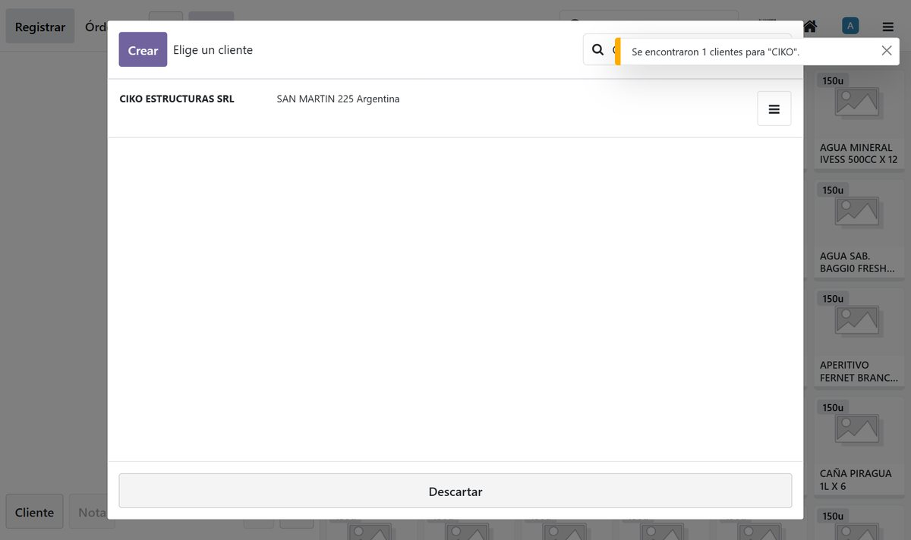
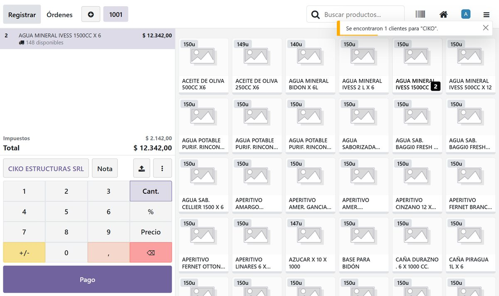
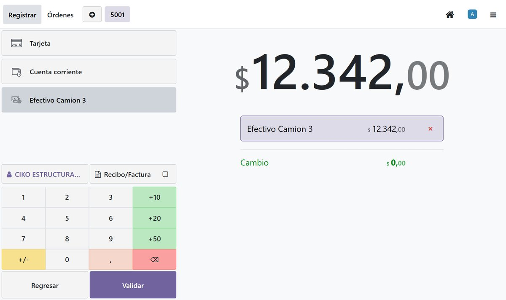
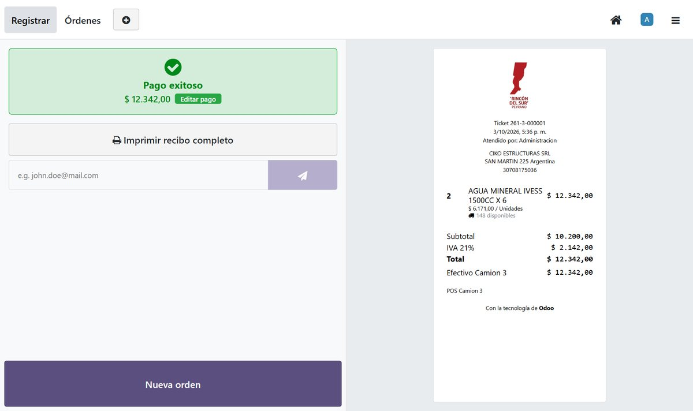

> Un mismo punto de venta solo puede tener **una caja abierta a la vez**: si un chofer está usando el Camión 1, abrí otro.

### 3.6 Listado de despacho

Es el listado de **todo lo vendido que todavía no salió del depósito**. Lo confirma **Depósito** (sección 4.2); si hace falta, Administración puede hacerlo igual desde **Inventario → Operaciones → Listado de despacho**.

### 3.7 Deudores y Cuenta Corriente

- **Punto de venta → Deudores**: los clientes que deben plata, **los más atrasados primero**. Un cliente que pagó todo desaparece de la lista; un pago parcial **reinicia el contador de días**.
- **Punto de venta → Cuenta Corriente**: el historial completo de cada cliente, con cada **Pedido** (en rojo, lo que deben) y cada **Pago**, y el **Saldo** después de cada movimiento. Se puede agrupar por cliente o por vendedor. Es de **solo lectura**.

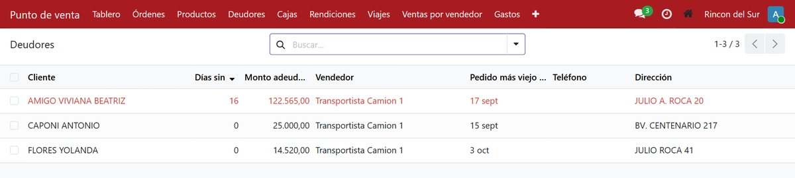
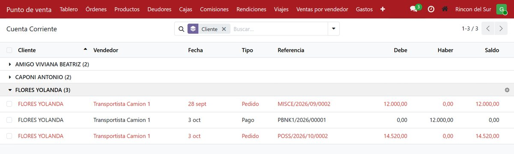

### 3.8 Rendir a un chofer

Al final del día, cada chofer te entrega el efectivo y las transferencias que cobró. Vos lo registrás en una **Rendición**.

1. **Punto de venta → Rendiciones → Nuevo**.
2. Elegí el **Vendedor** (el chofer) y **guardá** (☁). El sistema calcula solo cuánto **debería** entregar: **Esperado Efectivo** y **Esperado Transferencia** (todo lo que cobró y todavía no rindió, **ventas y deudas cobradas**).
3. Contá lo que te entrega y escribilo en **Recibido Efectivo** / **Recibido Transferencia**. La **Diferencia** se calcula sola (si es distinta de cero, quedó faltante o sobrante).
4. Tocá **Rendir**. Queda **Rendido** y ya no se puede editar.

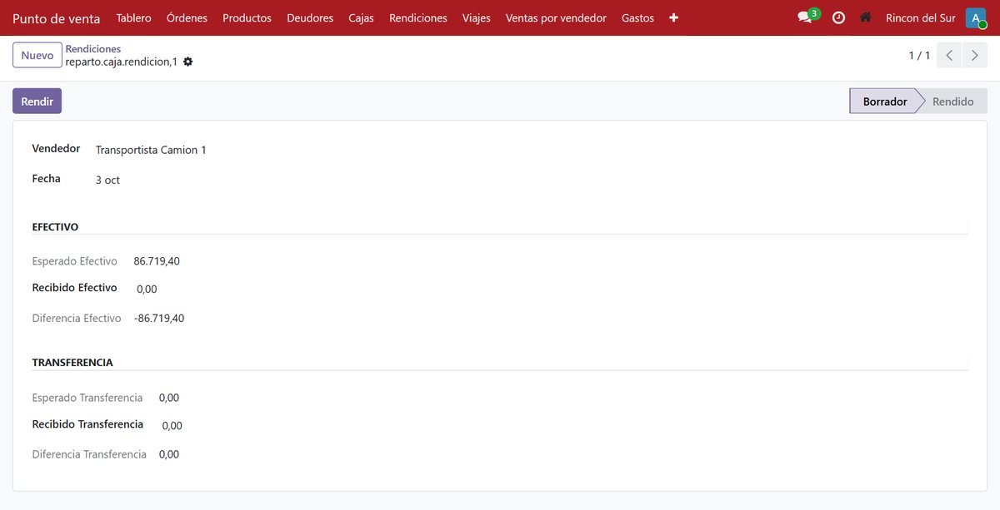
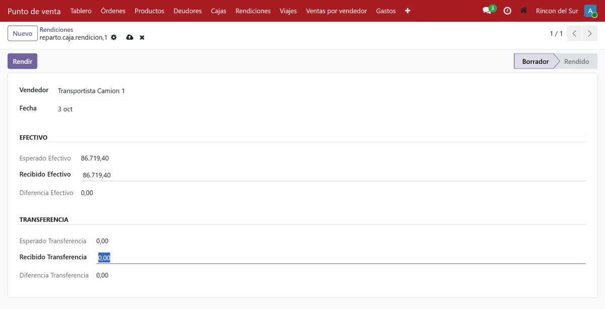
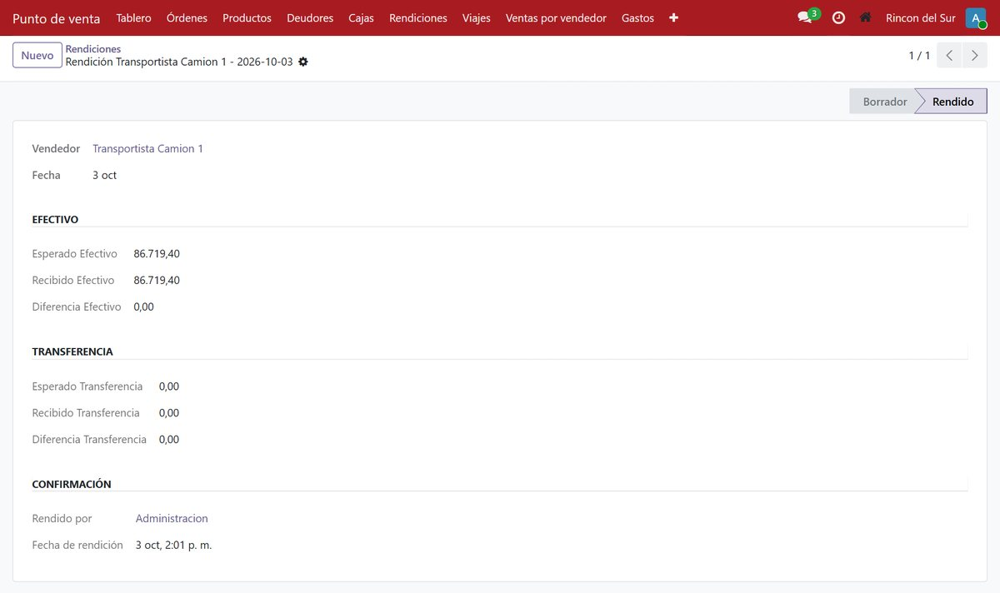

> Un chofer puede rendirse más de una vez en el día: cada rendición junta lo pendiente hasta ese momento.

### 3.9 Gastos

Para anotar un egreso de las cajas (por ejemplo, plata del efectivo que se usó para nafta).

1. **Punto de venta → Gastos → Nuevo**.
2. Completá la fila: **Caja** (Efectivo o Transferencia), **Monto**, **Vendedor responsable** y **Motivo**.
3. Tocá **Guardar**.

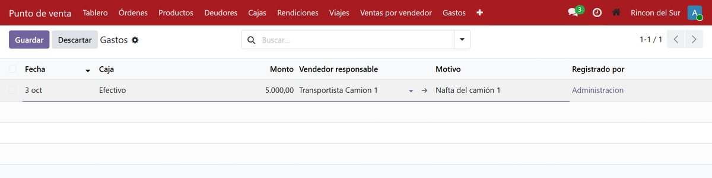

El gasto **resta** del saldo de la caja que elegiste (ver Cajas, 3.10).

### 3.10 Cajas

**Punto de venta → Cajas** muestra el **Saldo Caja Efectivo** y el **Saldo Caja Transferencia** de la empresa. El saldo **sube** cuando se confirma una rendición (y con los cobros de vendedores externos) y **baja** con los gastos.

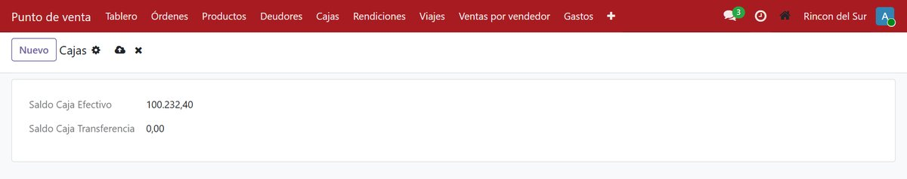

### 3.11 Ventas por vendedor

**Punto de venta → Ventas por vendedor**: por vendedor y por mes, cuántos **pedidos**, cuántas **unidades** y el **importe total**. Arriba a la derecha podés pasar de tabla a **gráfico**. Es lo **vendido**; lo **cobrado** y la comisión están en Gerencia (5.2).

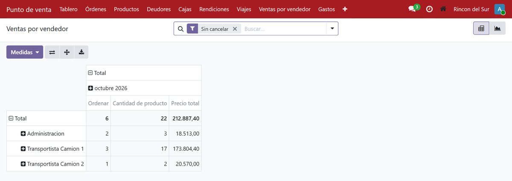

## 4. Depósito

### 4.1 Cargar o ajustar el stock

El stock es **uno solo para toda la empresa** (ubicación **WH/Existencias**): los tres camiones venden contra el mismo stock. Ya no se "carga" cada camión.

1. **Inicio → Inventario → Operaciones → Inventario físico**.
2. Sacá el filtro **Mis conteos** (la **✕** del buscador) y buscá el producto.
3. En la columna **Contado** escribí la cantidad real que hay. Aparece la **Diferencia**.
4. Tocá **Guardar** y luego **Aplicar** en esa fila. El stock queda actualizado (**A la mano**).

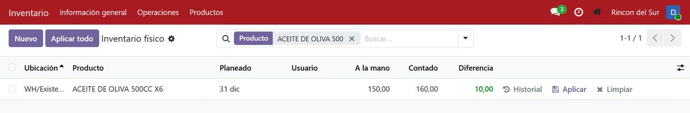
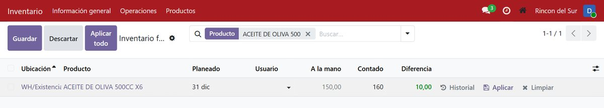
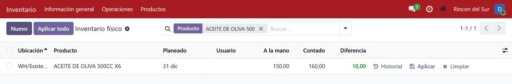

> En la grilla del punto de venta, el número de stock es una **foto** del momento en que se abrió la caja. El bloqueo **al cobrar** sí es exacto: compara contra el stock real y no deja vender de más.

### 4.2 Listado de despacho

Es el listado que Depósito imprime para **armar la carga**: todo lo vendido por los camiones que todavía no salió. **Confirmarlo es lo que descuenta el stock**, una sola vez.

1. **Inventario → Operaciones → Listado de despacho → Nuevo**.
2. La **fecha** viene con el día de hoy. La pantalla muestra, sin descontar nada todavía, lo que entraría: **Por camión** (qué productos y cuántas unidades lleva cada camión, con su chofer) y **Por cliente** (qué lleva cada cliente).
3. Tocá **Confirmar e imprimir**. Avisa que va a descontar el stock y que no se puede deshacer: tocá **De acuerdo**.
4. El despacho queda **Confirmado** con su número (por ejemplo **DESP/2026/0001**) y quién lo confirmó.

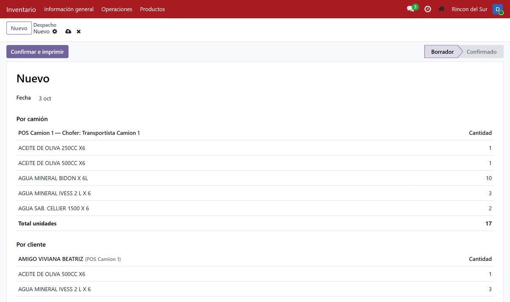
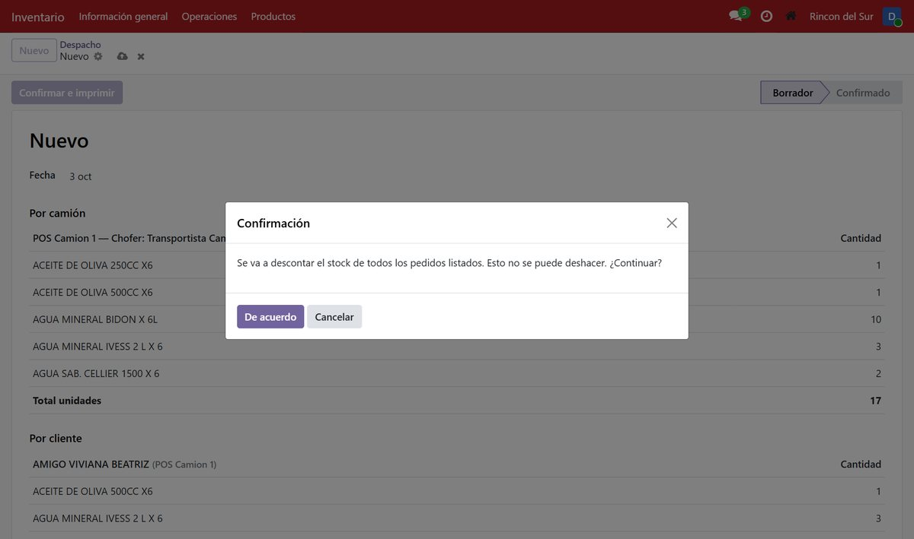
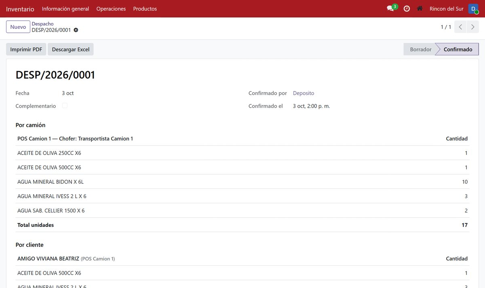

Con los botones **Imprimir PDF** y **Descargar Excel** podés reimprimir las veces que quieras: **reimprimir no vuelve a descontar stock**.

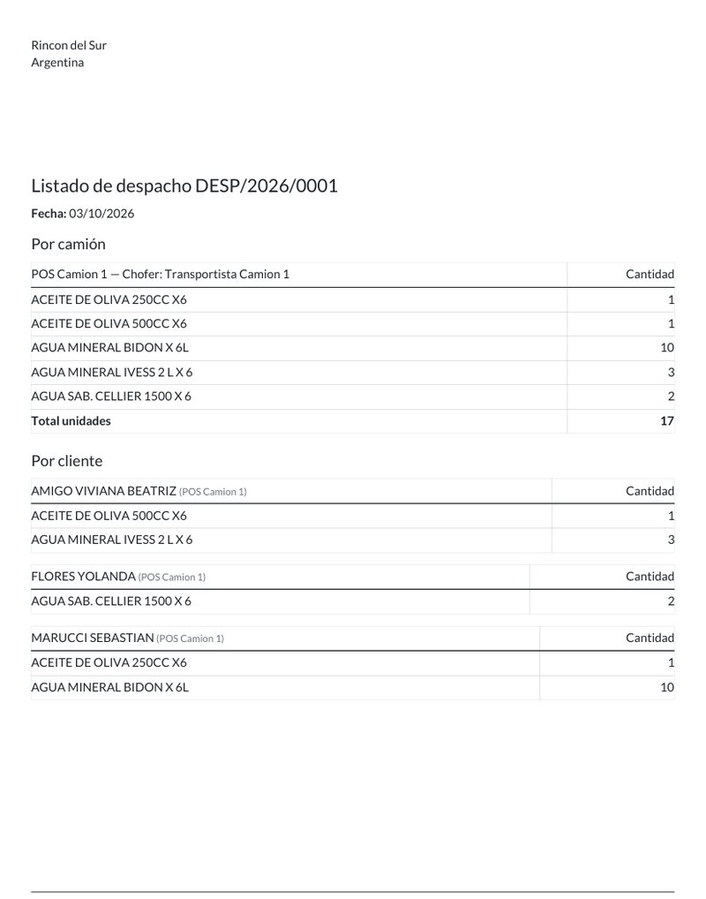

**Entran** los pedidos de esa fecha **y los atrasados** que todavía no salieron. Si después de confirmar entra otro pedido del mismo día, creá un **nuevo despacho** para esa fecha: trae solo los pedidos nuevos y queda marcado como **Complementario**.

> Un despacho confirmado **no se puede borrar** porque ya movió stock. Si falta stock de algún producto, el sistema no confirma y avisa cuál: corregí el stock (4.1) y volvé a intentar.

## 5. Gerencia

Gerencia ve todo lo de Administración (secciones 3.7 a 3.11: Deudores, Cuenta Corriente, Cajas, Gastos, Ventas por vendedor, Viajes) y además **Comisiones**, **Vendedores** (para cargar el % de comisión) y **Facturación** (para registrar cobros). Las **rendiciones** las ve pero no las confirma: eso lo hace Administración.

### 5.1 Cajas y cobranza

- **Cajas**: saldo real y actual de la empresa en efectivo y transferencia (3.10).
- **Deudores** y **Cuenta Corriente**: quién debe y el detalle de cada cliente (3.7). En Cuenta Corriente podés **filtrar por vendedor** para mirar la cobranza de su cartera.

### 5.2 Ver las comisiones

**Punto de venta → Comisiones**: una tabla por **vendedor y mes** con lo **cobrado** y la **comisión** resultante (con el botón **Medidas** elegís qué mostrar). Es de **solo lectura**: las genera el sistema con cada cobro real.

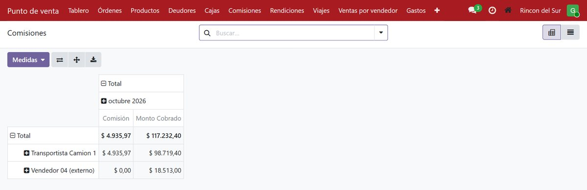

**Cuándo se genera la comisión.** Cuando **se le cobra al cliente**, no cuando se carga el pedido:

| Tipo de venta | Cuándo se genera |
|---|---|
| **Contado** (efectivo o tarjeta) | Al cobrar la venta en el camión. |
| **Cuenta corriente** | Cuando el cliente **paga** esa deuda. Si paga en partes, cada pago genera su parte proporcional. |

Solo cuenta si el cliente tiene **vendedor asignado**. Un cambio del porcentaje vale **para lo que se cobre desde ese momento**: las comisiones ya generadas no se modifican. Los **vendedores externos** figuran siempre al **0%**.

### 5.3 Registrar el cobro de una deuda

Lo hace Gerencia desde la oficina (cuando un cliente paga en el negocio o por transferencia, fuera del camión).

1. **Inicio → Facturación → Clientes → Pagos**, y tocá **Nuevo**.
2. Elegí el **Cliente** y el **Importe**.
3. En **Diario** dejá **Banco** si fue transferencia o depósito; si fue efectivo, elegí una **Caja Camión** (cuenta como efectivo).
4. Agregá un **Memo** (por ejemplo, "Transferencia a cuenta") y tocá **Confirmar**.
5. El pago queda **En proceso** y **ya descuenta la deuda**: el cliente se actualiza en **Deudores** (si pagó todo, desaparece) y aparece como **Pago** en su **Cuenta Corriente**.

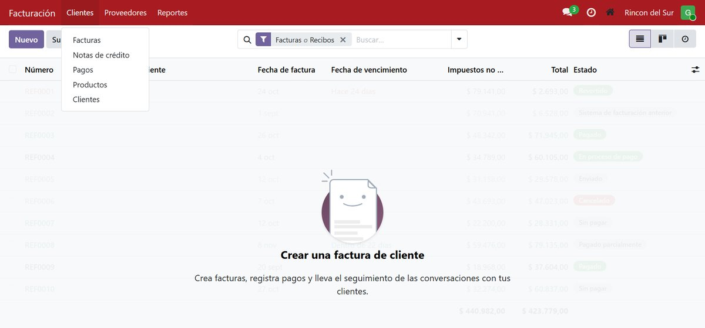
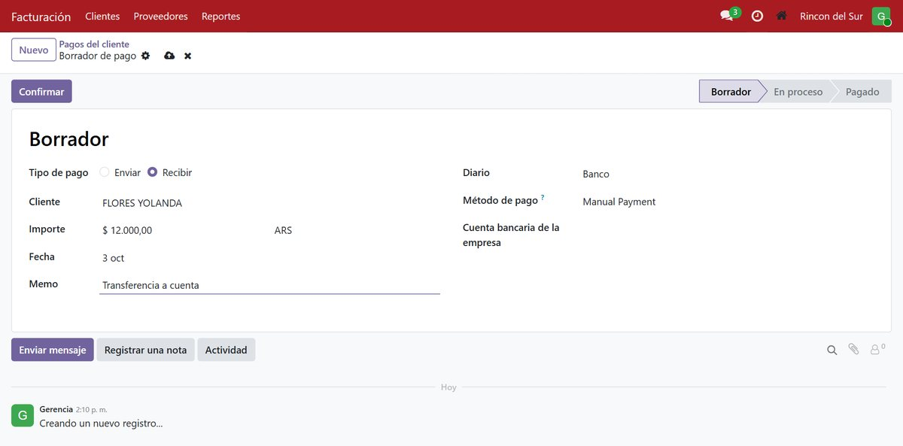
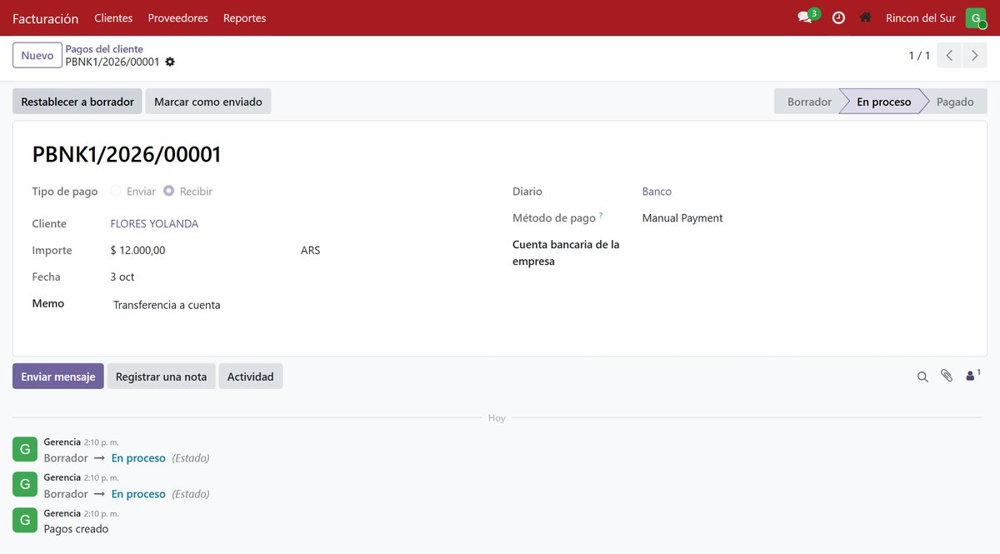

> En la calle el chofer usa su propio **cobro rápido** desde Viaje (2.4). Esta pantalla es para Gerencia, o para casos que el cobro rápido no cubre (por ejemplo, cobrar de más o corregir un cobro mal cargado).

### 5.4 Cargar el porcentaje de comisión de un vendedor

1. **Inicio → Punto de venta → Vendedores**. Ves la lista de vendedores con su camión, su **% Comisión** y si son externos.
2. Abrí el vendedor, escribí el **% Comisión** y guardá (☁).
3. En el mismo lugar podés tildar **Vendedor externo (sin comisión ni rendición)** para quien no usa camión (ver 3.5).

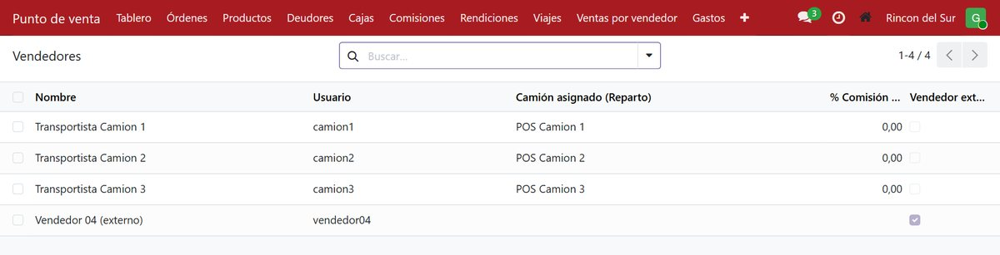
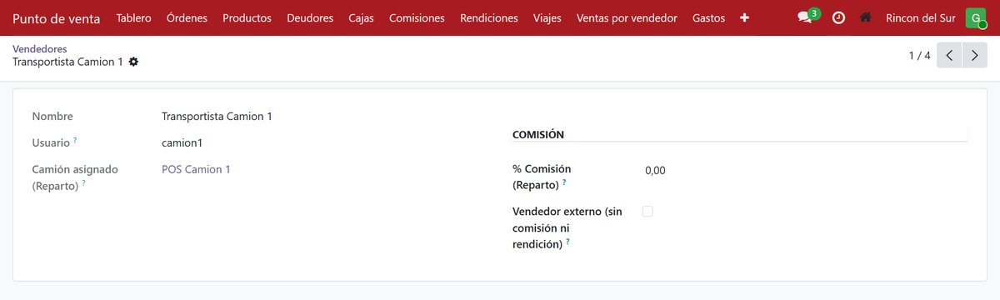

> **Un cambio de porcentaje vale para lo que se cobre desde ese momento.** Las comisiones ya generadas no se modifican. Desde esta pantalla Gerencia no puede cambiar claves, camiones ni permisos: eso lo hace el administrador del sistema (sección 6).

## 6. Administrador del sistema

Para quien administra el sistema (usuario **admin**). Se llega con el **selector de aplicaciones** (el ícono de cuadrados ⊞ arriba a la izquierda) → **Ajustes → Usuarios y empresas → Usuarios**.

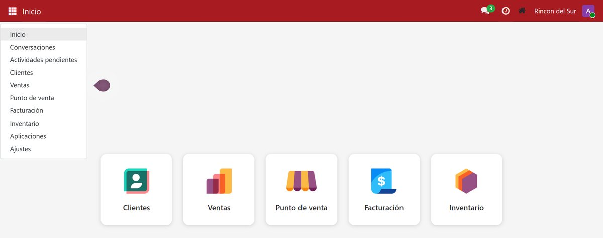
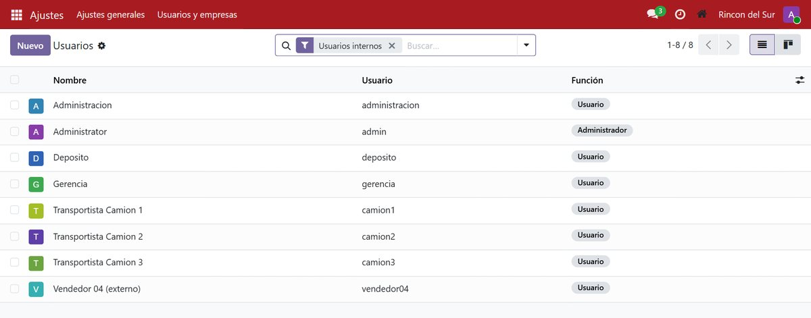

### 6.1 Cambiar una contraseña o el nombre de un usuario

1. Abrí el usuario.
2. Para el nombre o el usuario de ingreso, cambialos arriba y guardá. No se pierde ninguna configuración.
3. Para la clave: engranaje **⚙ Acciones → Cambiar contraseña** (o **Enviar instrucciones para restablecer la contraseña** si tiene correo). Entregala por un canal privado y pedí que la cambie al primer ingreso.

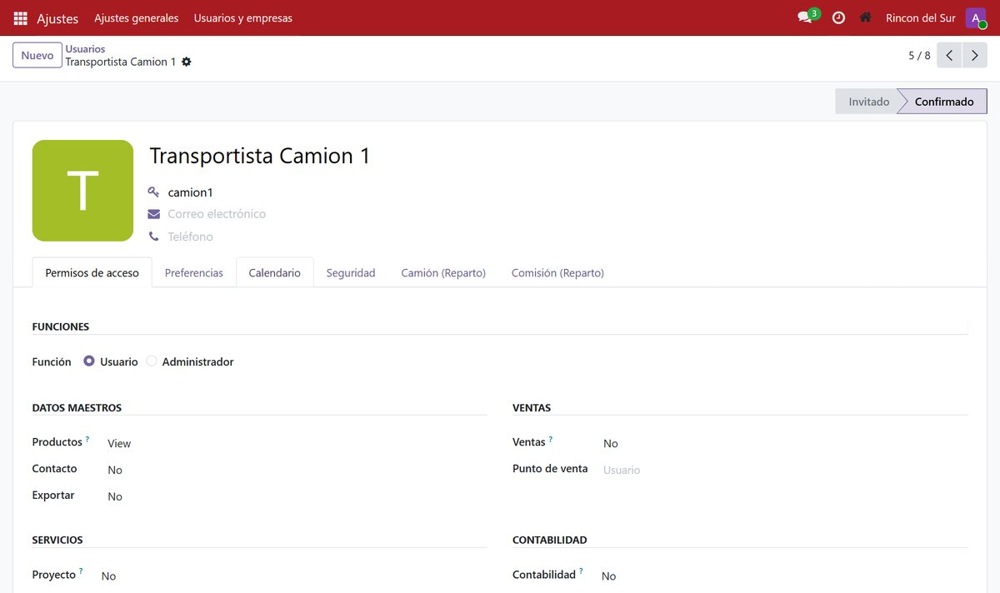
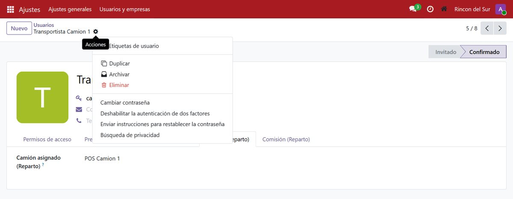

### 6.2 Camión y comisión de cada vendedor

En la ficha del usuario hay dos pestañas propias del sistema:

- **Camión (Reparto)**: el **camión asignado** (su punto de venta). **Solo verá ese camión.**
- **Comisión (Reparto)**: el **% Comisión** y la casilla **Vendedor externo (sin comisión ni rendición)**. Gerencia también las edita, desde **Punto de venta → Vendedores** (5.4).

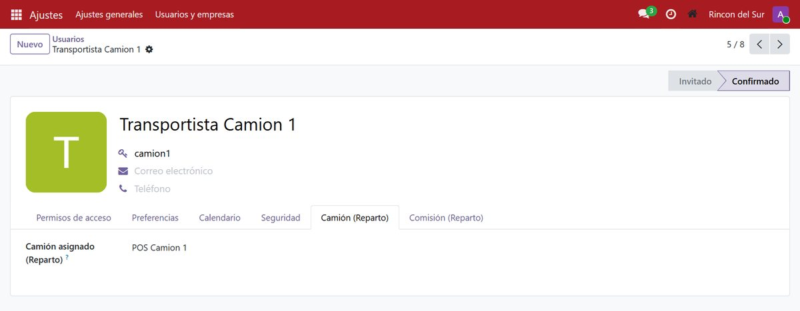
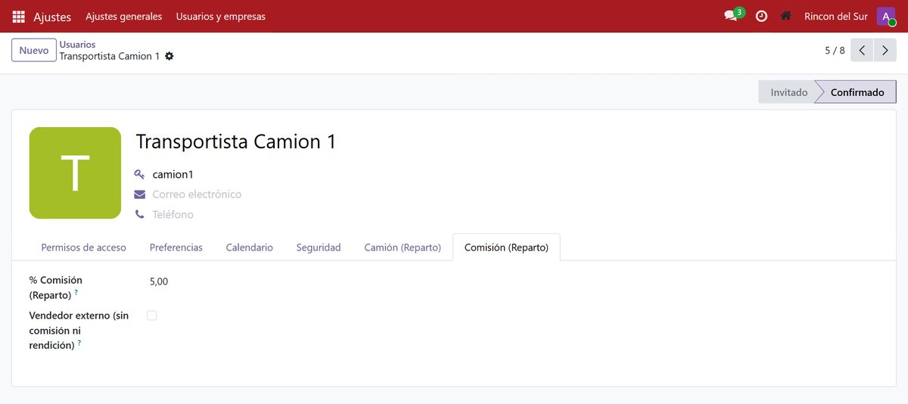

### 6.3 Crear un usuario nuevo

1. **Usuarios → Nuevo**. Escribí el **nombre** y el **usuario** de ingreso.
2. En la pestaña **Permisos de acceso**, bajá hasta el bloque **REPARTO** y elegí **un** **Rol de Reparto**: *Vendedor*, *Depósito*, *Administración Operativa* o *Gerencia*.
3. Si es **vendedor**, en **Camión (Reparto)** elegí su camión.
4. Asignale una contraseña (6.1) y **asignale sus clientes** (3.1): si no, no verá ninguno.

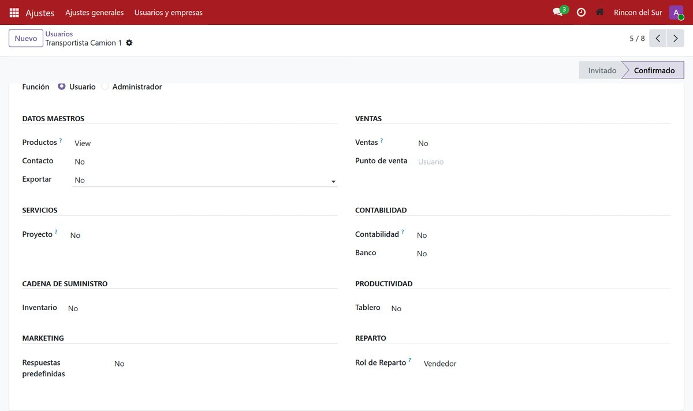

### 6.4 Vendedor externo

Para un vendedor que **no usa camión**: creá el usuario **sin** rol de Reparto ni contraseña, y en **Comisión (Reparto)** tildá **Vendedor externo**. Después asignale sus clientes (3.1). Sus ventas las carga Administración (3.5).

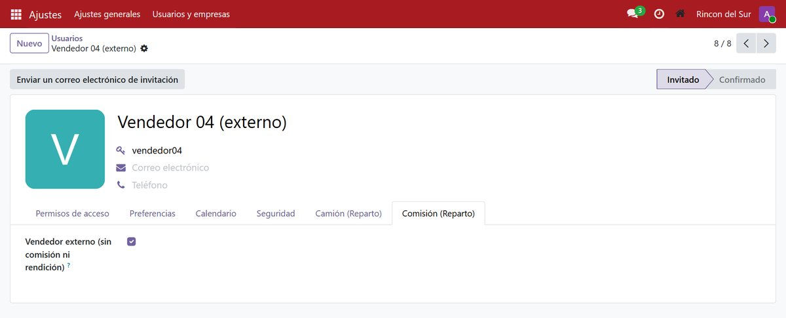

### 6.5 Camiones

Hay **tres camiones**, cada uno con su punto de venta. El **stock es general** y las **cajas son de la empresa**, no por camión. Para sumar un camión nuevo, pedilo al equipo técnico.

> Ante cualquier problema con los datos (algo que desapareció, un número que no cierra), **no borres ni corrijas nada a mano**: avisá al equipo técnico.

## 7. Preguntas frecuentes y problemas comunes

**No veo ningún cliente en el punto de venta.**
El cliente no tiene tu usuario como **Vendedor**. Pedile a Administración que se lo asigne (3.1).

**El botón Viaje da error.**
Probablemente un cliente de la lista no está asignado a ese chofer. Revisá el viaje y asignale el cliente.

**No me deja vender: "Stock insuficiente".**
No hay esa cantidad en el stock general. Depósito tiene que cargarla (4.1) o hay que bajar la cantidad.

**Un producto no aparece en el punto de venta.**
No tiene tildado **Punto de venta** (3.3).

**El aviso de deuda, ¿me impide vender?**
No, es solo informativo.

**Cambié un precio o un descuento y el camión no lo toma.**
En la tablet: menú **☰ → Volver a cargar datos → Completo**. Si no, cerrá y abrí el punto de venta.

**Veo un `?` en vez del stock de los productos (o el descuento por cantidad no se aplica).**
El navegador tiene una copia vieja de los productos, típico después de una actualización del sistema. Menú **☰ → Volver a cargar datos → Completo**.

**Una venta a cuenta corriente no aparece en Deudores.**
La deuda se registra al **cerrar la caja** del chofer (2.6).

**No me deja abrir la caja de un camión.**
Ese punto de venta ya tiene una caja abierta (otro usuario, o una caja sin cerrar). Cerrala primero.

**La pantalla queda cargando y no abre (después de una actualización).**
Es una copia vieja guardada en el navegador. Probá en una pestaña privada; si anda, borrá los **datos del sitio** en la configuración del navegador.

**Salió un cartel de error de JavaScript en el celular.**
Es del navegador (Brave o Firefox en iPhone), no del sistema. Usá **Safari**.

**Me olvidé la contraseña.**
Pedile una nueva al administrador del sistema (6.1).

**Limitaciones actuales**

- No hay facturación fiscal (se hace con el programa externo).
- El viaje es una lista de paradas, no una ruta optimizada por mapa.
- Las paradas se agregan a mano.
- Los remitos todavía no se envían por correo al cliente (falta configurar el correo saliente).
- El ticket del punto de venta no ofrece factura: este sistema no factura.

## 8. Un día típico en Rincón del Sur

**7:30 — Oficina.** Administración arma (o revisa) el **viaje** de cada camión (3.2). Si un cliente llamó el día anterior, lo suma como parada extra (3.2). Mira **Cuenta Corriente** (3.7) para avisarle a los choferes qué clientes tienen deuda vieja.

**8:00 — Depósito.** Carga en el **Inventario físico** la mercadería que llegó (4.1): un solo stock para los tres camiones.

**8:15 — Salen los camiones.** Cada chofer abre **Viaje** en su celular y toca la primera parada. Abre la caja con su efectivo de apertura (2.2).

**9:40 — Venta de contado.** El chofer carga el pedido; los descuentos por cantidad se aplican solos. Cobra en **efectivo**: queda pendiente de rendir (2.2).

**10:15 — Cliente con deuda.** En **Viaje** ve el monto en rojo, lo toca y le cobra **una parte** en efectivo (2.4). Después carga la venta del día.

**11:30 — Falta stock.** El sistema avisa **Stock insuficiente** (2.2). El chofer vende lo que hay y avisa a Depósito.

**13:00 — Se corta la señal.** Sigue vendiendo: las ventas se envían solas al volver la señal (2.5).

**17:30 — Vuelven los camiones.** Cada chofer **cierra su caja** (2.6).

**18:00 — Rendición.** Administración rinde a cada chofer (3.8) y anota los gastos del día (3.9).

**18:15 — Gerencia.** Mira **Cajas**, **Comisiones** y **Cuenta Corriente** (sección 5). Si un cliente pagó en el negocio, registra el cobro (5.3).

**Despacho.** Depósito confirma el **listado de despacho** de lo vendido (4.2): recién ahí se descuenta el stock. Al día siguiente, todo vuelve a empezar.

---

*Documento vivo: se actualiza cuando cambia o se suma una funcionalidad.*
